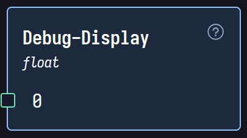

# Debug-Display

The Debug-Display node displays any value connected to it from another node. It is useful for debugging purposes, allowing you to see the values you're trying to manipulate and check if they resemble your targeted behaviours. Additionally, it can help identify discrepancies in data flow and logic errors in your application.

## Properties

- **Input**: This is the Connection point for the input value. It can be connected to any node that outputs a value.
- **Display**: This is where the value will be shown on the interface, allowing users to visualize the data being processed.
